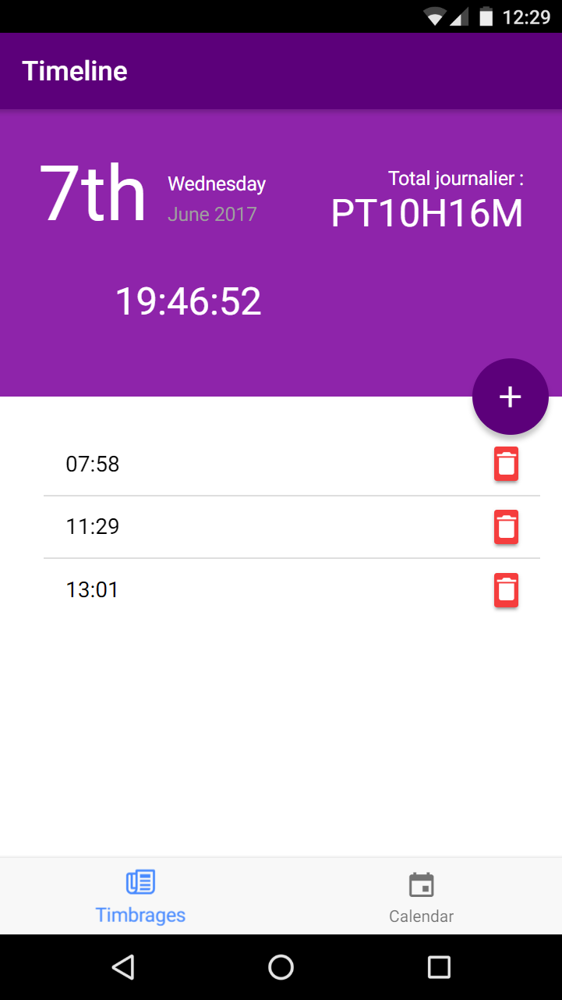
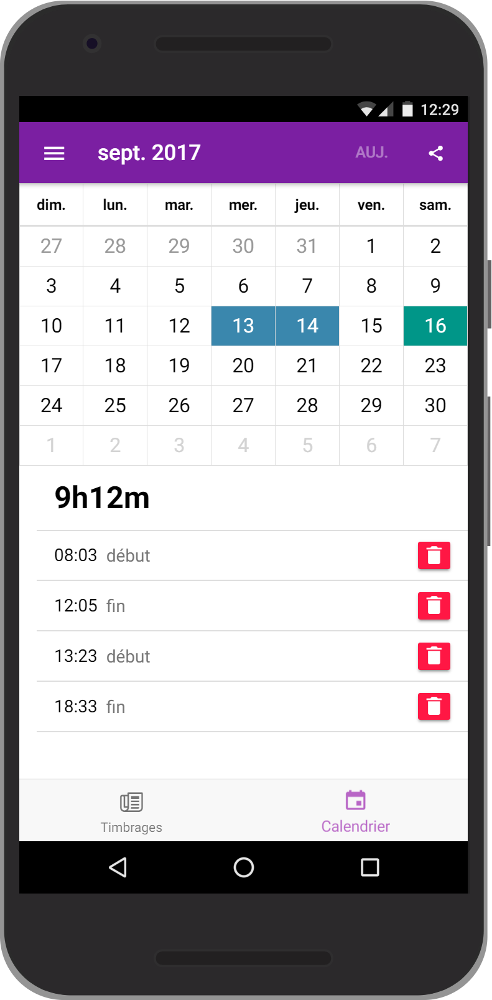

[]()
[](http://makeapullrequest.com)
[]()

# Timbrage - reporting quotidien

_Application d'aide au reporting quotidien, outils de productivité._

Cette application permet d'enregistrer rapidement et simplement son temps de travail quotidien, pratique pour la facturation au client ;)

Le code est **open source sous license Apache 3.0** pour permettre une transparence total aux usagés de l'application et la pérénité de cette transparence.

Toute contribution est la bienvenue !

La version actuel est basé sur le très réputé framework ionic qui lui même se base sur angular et cordova. Le tout permet d'obtenir une application type web facilement déployable sur windows/android/ios/serveur web.

## Ecrans de saisie quotidien/vue mensuelle :

 

## Développement

[Génération des icones](https://romannurik.github.io/AndroidAssetStudio/icons-generic.html#source.type=image&source.space.trim=1&source.space.pad=0&size=85&padding=0&color=rgba(96%2C%20125%2C%20139%2C%200)&name=icon)

[Choix des couleurs](https://www.materialpalette.com/purple/teal)

```bash
# lancement en local
ionic serve

# déploiement sur device android
ionic cordova run android --device --prod
```
